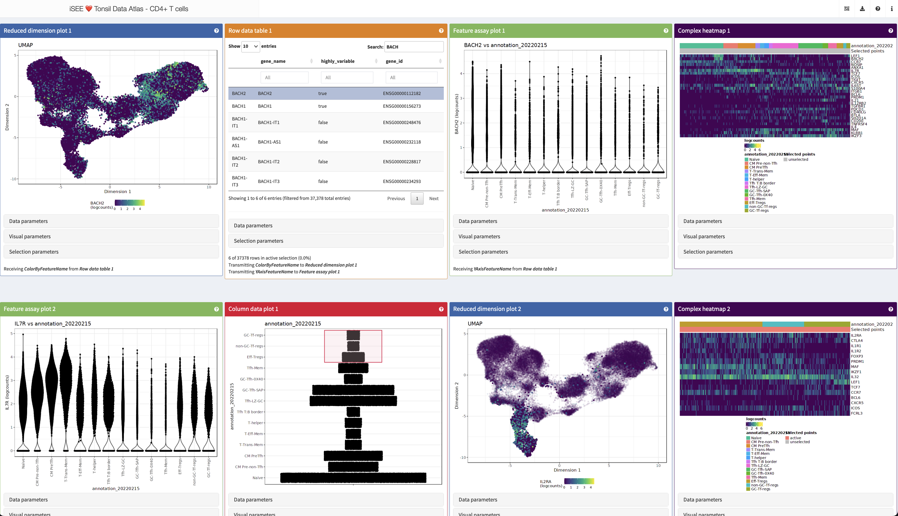
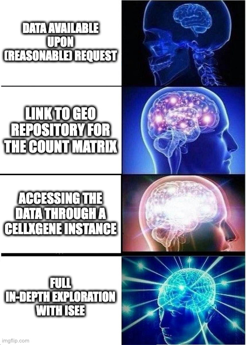

```{r, include = FALSE}
knitr::opts_chunk$set(
  collapse = TRUE,
  comment = "#>"
)
suppressPackageStartupMessages({
    library(BiocStyle)
})
```


# Overview of the workshop

## Description

The iSEE package is a flexible, powerful and extendible application to explore any dataset stored in SummarizedExperiment objects, including single cell and spatially resolved data. 

iSEE enables a multitude of panels to gain in-depth insight in your data; it does so combining interactivity and reproducibility, and providing an ideal companion to CELLxGENE for deeper dives into data.

This package demo provides an overview of the functionality of the `r Biocpkg("iSEE")` Bioconductor package, and is intended as an appetizer to more.

## Pre-requisites

* Familiarity with single-cell sequencing data (ideally scRNA-seq)
* Familiarity with the SummarizedExperiment/SingleCellExperiment class, or 
alternatively the Seurat or AnnData frameworks - basically, any of the widely used 
ecosystem for working with/storing/processing single cell data
* Familiarity with single-cell data visualizations and representations

## Participation

Participants will be able to follow along in the live coding parts of the demo.

## _R_ / _Bioconductor_ packages used

* `iSEE`: https://bioconductor.org/packages/iSEE
* `iSEEde`: https://bioconductor.org/packages/iSEEde
* `iSEEindex`: https://bioconductor.org/packages/iSEEindex
* `iSEEpathways`: https://bioconductor.org/packages/iSEEpathways
* `iSEEhub`: https://bioconductor.org/packages/iSEEhub

<!-- ## Time outline -->

<!-- | Activity                                        | Time | -->
<!-- |-------------------------------------------------|------| -->
<!-- | Overview of iSEE                                | 20m  | -->
<!-- | Building up your own iSEE instance              | 10m  | -->
<!-- | New and extra features in the iSEE ecosystem    | 15m  | -->

## Workshop goals and objectives

### Learning goals

* Outline the features of iSEE, built upon the RStudio Shiny framework
* Utilize interactive GUI components and layouts to efficiently extract information from biological data sets
* Describe how to construct interactive apps and custom panels
* Demonstrate how these package can smoothly be integrated into and enhance existing workflows for the datasets at hand

### Learning objectives

* Set up a local environment for running iSEE apps
* Interact with components of the iSEE user interface to visually inspect and discuss various data sets
* Identify and locate configurable aspects of iSEE apps
* Practice interactive visualization over a single-cell RNA-sequencing workflow
* Imagine use cases and future developments for interactive visualization as part of computational workflows
* Design and create iSEE instances for collections of datasets

# Installing and loading the required packages

To run the content presented in this demo, run this following chunk in your R environment.

```{r eval = FALSE}
library("BiocManager")
BiocManager::install("iSEE/iSEEdemo")

```

We start by loading the packages that will be used during the demo. 

```{r, message=FALSE, warning=FALSE}
library("SingleCellExperiment")
library("iSEE")
library("TENxPBMCData")

library("iSEEu")
library("iSEEde")
library("iSEEpathways")
library("iSEEhub")
library("iSEEindex")
```

All of these would be loaded if you run

```{r}
library("iSEEdemo")
```

You can also clone this repository (https://iSEE.github.io/iSEEdemo) locally by `git clone` - it makes it easy to follow along this vignette!

# Let's go get us some data!

We will start very much *in medias res*, assuming that this might be the ideal point where you have processed your data - early or late phase - and now want to have the BEST look at that.

Navigate to https://zenodo.org/records/10084595 and download the data (it contains the three objects you might be "coming from").  
Unpack the archive you downloaded in the `datasets` subfolder of the `vignette` folder.

We included a `SingleCellExperiment` object on a processed version for the PBMC3k dataset, many of you can somehow be familiar with this.

Let's load the dataset in our environment:

```{r}
sce_pbmc3k <- readRDS(
  file = system.file("datasets", "sce_pbmc3k.RDS", package = "iSEEdemo")
)

sce_pbmc3k
```


# As easy as saying `iSEE(sce)`!

Who of you is investing a fair amount/lot of time in doing proper data exploration?

Who of you is familiar with the beautiful CellxGene tool?

Who of you dreamed to do even more on your data?

I have a quiz for you - have a look at this, for example:

http://shiny.imbei.uni-mainz.de:3838/iSEE_Tonsils_CD4Tcells/

```{r, echo=FALSE}

```

<details>
<summary>Question 1</summary>
How many lines of code are required to realize this?

A) 4-5  
B) 250-300 
C) 7500-10000  
</details>


<details>
<summary>Question 2</summary>
How many of these lines had to be typed by a human?

A) 4-5  
B) 250-300  
C) 7500-10000  
</details>

So, yes, I will show you that is as easy as that:

```{r, eval=FALSE}
library("iSEE")
iSEE(sce_pbmc3k)
```

Let's run this together and see what we have got in store.



# Quick tour of the panels

What typical visualizations people would you use to represent and explore your datasets?

Each panel has some essential content:

* Data parameters
* Visual parameters
* Selection parameters

Let's have a closer look at that on the Reduced Dimension Plot 1 panel.

If you have no idea of what a panel can "normally" do, look for the question mark icon, that will start a tiny tour on its functionality.

# Additional UI functionality

iSEE also has some additional controls, grouped into the header bar, let's have a look at them:

* Organization buttons
* Export buttons
* Documentation buttons
* Extra info buttons

With this, we can...

- reorganize the panel layout - add, remove, re-order
- extract the code to exactly reproduce the outputs, 1:1
- store (and re-utilize) the panel settings
- generate at once an archive with all/selected parts of the panel outputs
- start a tour on the content displayed - yes, you can very much tell a story with iSEE!

# In depth exploration of data - iSEE's main functionality 

## You can control pretty much everything in a plot

Coloring by, faceting, zooming, hovering!  
Make a wish!

## You can link any panel to any other panel

Brush selection, lasso selection, select the receiving panel, iterate!  
Read out information, see the panel transmission graph.

## You can use tables to navigate panels

Search and select, transmit, receive, iterate!

## Configuring your iSEE instance

Panels: add, move, remove; exporting the `initial` configuration, reloading it

## Reproducibility for the win!

A magic wand: two clicks away from all the R code you need; export all outputs, save individual images

## Sharing is caring, and so is telling a story

Start the tour, highlighting elements; make your data really explorable!

# Custom panels & the iSEE universe

A couple of additional things you can do with custom panels (and this is just an appetizer!):

* Custom panels: perform some extra steps
* Multiple selection and "DE on the fly"
* Check out `r Biocpkg("iSEEu")` for more
* Spatial data? We can already handle that with a workaround! See https://moffittlab.connect.hms.harvard.edu/merfish/merfish_homepage.html for an example

# Got data?

## Got single cell data?

You might have got the gist:

```{r, eval=FALSE}
sce <- sce_pbmc3k # Load your data in some manner
library("iSEE")
iSEE(sce)
```

So, yes, we mighe be down to THREE lines of code.

## Got some special feature in your data?

Maybe `r Biocpkg("iSEEu")` can be the place to find already that piece of functionality!

## Got bulk?

Have a look at the functionality provided by 

* `r Biocpkg("iSEEde")`
* `r Biocpkg("iSEEpathways")`

These can be ideal companions for exploring DE results.

`r Biocpkg("iSEEde")` and `r Biocpkg("iSEEpathways")` are two new Bioconductor packages that provide `r Biocpkg("iSEE")` panels specifically aimed towards exploration of differential expression and pathway analysis results. 
More precisely, `r Biocpkg("iSEEde")` provides the `VolcanoPlot`, `MAPlot`, `LogFCLogFCPlot` and `DETable` panels. 

## Got many datasets?

Have a look at the functionality provided by 

* `r Biocpkg("iSEEhub")`
* `r Biocpkg("iSEEindex")`

The `r Biocpkg("iSEEhub")` package provides a custom landing page for an `r Biocpkg("iSEE")` application interfacing with the Bioconductor `r Biocpkg("ExperimentHub")`. 
The landing page allows users to browse the ExperimentHub, select a data set, download and cache it, and import it directly into an iSEE app.

`r Biocpkg("iSEEindex")` provides an interface to **any** collection of data sets within a single iSEE web-application.  
The main functionality of this package is to define a custom landing page allowing app maintainers to list a custom collection of data sets that users can select from and directly load objects into an iSEE web application.  

> One iSEE instance to ~~rule~~ exlore them all...

A more elaborate example is available at [https://rehwinkellab.shinyapps.io/ifnresource/](https://rehwinkellab.shinyapps.io/ifnresource/). 
The source can be found at [https://github.com/kevinrue/IFNresource](https://github.com/kevinrue/IFNresource). 

<!-- Possible actions: -->
<!-- navigate to github repo -->
<!-- explore the app.R file -->
<!-- check the initial state files -->
<!-- have a look at the configuration yaml -->

Potential use cases can include:

* An app to present and explore the different datasets in your next publication
* An app to explore collection of datasets collaboratively, in consortium-like initiatives
* An app to mirror and enhance the content of e.g. the CellxGene data portal
* Got any ideas on how to use iSEE for such deployments?

# Interoperability

"Wait, I got Seurat/Anndata objects".

The single cell communities got you covered:

## From Seurat...

```{r eval=FALSE}
library("Seurat")

seurat_object <- readRDS("datasets/seurat_pbmc3k.RDS")
sce_from_seurat <- Seurat::as.SingleCellExperiment(
  seurat_object
)
sce_from_seurat


iSEE(sce_from_seurat)
```

## From AnnData...

... which is basically able to serve any dataset available throught the CELLxGENE Data Portal!

```{r eval=FALSE}
library("zellkonverter")

sce_from_anndata <- zellkonverter::readH5AD(file = "datasets/anndata_pbmc3k.h5ad")
sce_from_anndata

iSEE(sce_from_anndata)
```

An example could be... 

https://cellxgene.cziscience.com/e/c7856243-c59a-4b70-8ce7-25b94c2d9da1.cxg/


# I want moaaaaar on iSEE!

For more extensive descriptions of the different parts of the interface, we refer to the [overview](https://isee.github.io/iSEEWorkshopEuroBioc2020/articles/overview.html) vignette in a previous, extended workshop on `r Biocpkg("iSEE")`.

Additional material can also be found at these other repositories:

* https://isee.github.io/iSEEWorkshop2020/
* https://isee.github.io/iSEEWorkshopEuroBioc2020/
* https://isee.github.io/iSEEDemoEuroBioC2023/

# Session info {-}

```{r}
sessionInfo()
```
